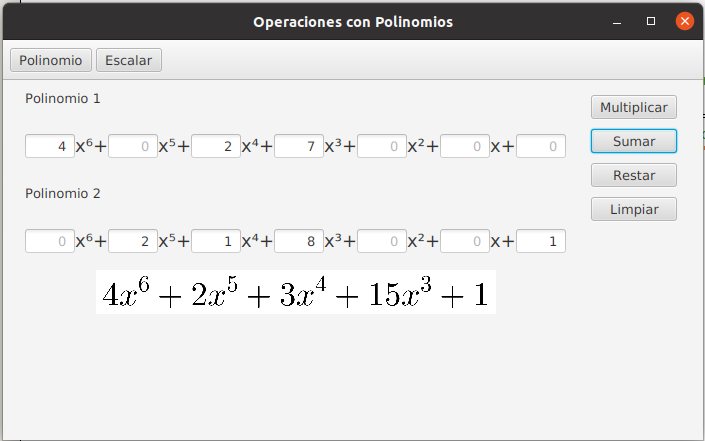

# Operaciones Con Polinomios

Proyecto Integrador de Estructura de Datos con Daniel G. Cantón Puerto.

Programa con interfaz de usuario que permite hacer operaciones de suma, resta, multiplicación de polinomios y
multiplicación de un polinomio por un escalar.

Los polinomios son representados con objetos lista doblemente ligados.

### Ejemplo 📋

## Construido con 🛠️

* [IntelliJ IDEA](https://www.jetbrains.com/es-es/idea/) - IDE
* [Maven](https://maven.apache.org/) - Manejador de dependencias

## Autores ✒️

_Menciona a todos aquellos que ayudaron a levantar el proyecto desde sus inicios_

* **Rodrigo Maliachi** - *Documentación y desarrollo* - [maliachi](https://github.com/RodrigoMaliachi)
* **Jonathan** - *Desarrollo* - [jonathan](https://github.com/Jony190229)
* **Alma** - *Desarrollo* - [alma](https://github.com/AlmaOS)
* **Natalí** - *Desarrollo* - [natali](https://github.com/NataliOA)